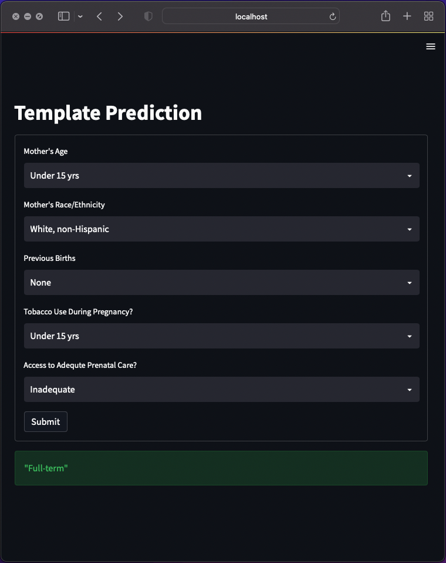

# Take-home assignment template

The purpose of this repository is to provide a quick-start for a data science take home problem.  They usually are framed like the following.
1. Here is some data and instructions  
2. Build a model for us using a Jupyter notebook  
3. Send us the notebook and/or some slides and we'll talk about it  

Years ago when we gave this problem to a candidate he went further to actually deploy a little model inside a web application.  We all really appreciated his desire to take a vision end to end, and this repo is meant to give a similar flavor.

With this repository you can be sure that you work is reproduced by a hiring committee because it's dockerized!  In my experience it pays dividends to actually walk through a notebook instead of just looking at the output.

## Data

This template includes an example dataset that I created based on iteratively querying the [New Jersey State Health Assessment Data](https://www-doh.state.nj.us/doh-shad/query/builder/birth/PretermAllCnty/Preterm.html), and these data are also available as an extract on [Kaggle](https://www.kaggle.com/datasets/natesutton/njpretermbirths).  Full caveats there is virtually no signal in this data to predict premature birth outcomes, it is merely meant to illustrate a problem.

## Services

This repository exposes four components that are useful in a data science proof of concept.
- A container running Jupyter notebooks with common machine learning libraries (port:8888).  Any notebooks will persist in a mounted volume (./volumes/notebooks)
- A container running Postgres in the event a relational database is useful (port:5432).  Any transformations will persist between containers in a mounted volume (./volumes/postgres)
- A container running FastAPI to serve predictions from a scikit-learn model (port:8080)
- A container running Streamlit allows a user to access the predictions from their scikit-learn model based on user inputs (port:8501)

## Usage
```
docker-compose up 
```

## Structure
```
|-- containers - code
|   |-- python      # interactive jupyter notebooks
|   |-- fastapi     # deploy pickled model as a REST API 
|   |-- streamlit   # access REST API in a user interface 
|-- volumes         # persistent data
|   |-- notebooks   # jupyter notebooks persisted here
|   |-- postgres    # database files persisted here, not in version control
|   |-- static      # static files that are loaded into postgres or jupyter
```

## Database

You can connect to PostgreSQL on localhost:5432 with a user 'local' and no password (POSTGRES_HOST_AUTH_METHOD=trust) with any SQL client you like.

## Package Manager

This template uses conda environments in each container.  Simply modify the environment.yml to add anything you like.

## REST API Endpoint

The model is available as a REST API endpoint on port 8080.  It accepts JSON data that look like 1 row of the dataframe it as trained on. 
```
curl --request POST http://127.0.0.1:8080/predict \
    -H 'Content-Type: application/json' \
    -d '{"age_group": "Under 15 yrs","reported_race_ethnicity": "White, non-Hispanic", "previous_births": "None","tobacco_use_during_pregnancy": "Yes","adequate_prenatal_care": "Inadequate"}'
```

## Streamlit User Interface

  

A small web application can take features used to drive your model, then return a prediction from the REST API.   

## Known Vulnerabilities
There is literally zero security.  Keep this on localhost.
- There is not password for the postgres database.
- The rest API calls are not encrypted.
- The jupyter notebook runs as root in a container.
- The user interface is exposed without encryption or a password.
